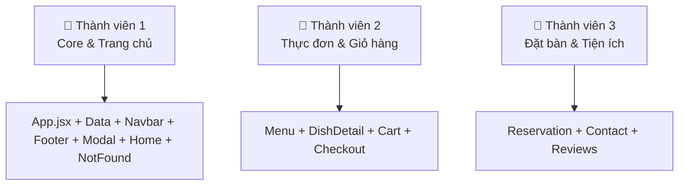

# Phân Chia Module - 3 Thành Viên

## Tổng quan



---

## 👤 Thành viên 1 — Core, Layout & Trang chủ

> **Vai trò**: Tạo nền tảng dự án, layout chung, dữ liệu mẫu, trang chủ

| File | Mô tả |
|---|---|
| [src/data/dishes.js](file:///c:/Users/DELL/OneDrive/Desktop/ferProject/restaurant-website/src/data/dishes.js) | Dữ liệu mẫu (món ăn, danh mục, đánh giá) |
| [src/App.jsx](file:///c:/Users/DELL/OneDrive/Desktop/ferProject/restaurant-website/src/App.jsx) | Router, cart state, modal state |
| [src/App.css](file:///c:/Users/DELL/OneDrive/Desktop/ferProject/restaurant-website/src/App.css) | Design system (biến CSS, buttons, forms) |
| [src/index.css](file:///c:/Users/DELL/OneDrive/Desktop/ferProject/restaurant-website/src/index.css) | CSS reset |
| [src/components/Navbar.jsx](file:///c:/Users/DELL/OneDrive/Desktop/ferProject/restaurant-website/src/components/Navbar.jsx) + [.css](file:///c:/Users/DELL/OneDrive/Desktop/ferProject/restaurant-website/src/App.css) | Thanh điều hướng + badge giỏ hàng |
| [src/components/Footer.jsx](file:///c:/Users/DELL/OneDrive/Desktop/ferProject/restaurant-website/src/components/Footer.jsx) + [.css](file:///c:/Users/DELL/OneDrive/Desktop/ferProject/restaurant-website/src/App.css) | Footer 4 cột |
| [src/components/Modal.jsx](file:///c:/Users/DELL/OneDrive/Desktop/ferProject/restaurant-website/src/components/Modal.jsx) + [.css](file:///c:/Users/DELL/OneDrive/Desktop/ferProject/restaurant-website/src/App.css) | Modal thông báo dùng chung |
| [src/pages/Home.jsx](file:///c:/Users/DELL/OneDrive/Desktop/ferProject/restaurant-website/src/pages/Home.jsx) + [.css](file:///c:/Users/DELL/OneDrive/Desktop/ferProject/restaurant-website/src/App.css) | Trang chủ (banner, giới thiệu, món nổi bật) |
| [src/pages/NotFound.jsx](file:///c:/Users/DELL/OneDrive/Desktop/ferProject/restaurant-website/src/pages/NotFound.jsx) + [.css](file:///c:/Users/DELL/OneDrive/Desktop/ferProject/restaurant-website/src/App.css) | Trang 404 |

**Tổng: 13 files** — Phải làm **trước tiên** vì các thành viên khác phụ thuộc vào Navbar, Footer, Modal, data, và App.jsx.

---

## 👤 Thành viên 2 — Thực đơn & Giỏ hàng

> **Vai trò**: Xây dựng luồng xem món → thêm giỏ → thanh toán

| File | Mô tả |
|---|---|
| [src/pages/Menu.jsx](file:///c:/Users/DELL/OneDrive/Desktop/ferProject/restaurant-website/src/pages/Menu.jsx) + [.css](file:///c:/Users/DELL/OneDrive/Desktop/ferProject/restaurant-website/src/App.css) | Danh sách món, filter danh mục, tìm kiếm |
| [src/pages/DishDetail.jsx](file:///c:/Users/DELL/OneDrive/Desktop/ferProject/restaurant-website/src/pages/DishDetail.jsx) + [.css](file:///c:/Users/DELL/OneDrive/Desktop/ferProject/restaurant-website/src/App.css) | Chi tiết món, chọn số lượng |
| [src/pages/Cart.jsx](file:///c:/Users/DELL/OneDrive/Desktop/ferProject/restaurant-website/src/pages/Cart.jsx) + [.css](file:///c:/Users/DELL/OneDrive/Desktop/ferProject/restaurant-website/src/App.css) | Giỏ hàng, tăng/giảm/xóa, tổng tiền |
| [src/pages/Checkout.jsx](file:///c:/Users/DELL/OneDrive/Desktop/ferProject/restaurant-website/src/pages/Checkout.jsx) + [.css](file:///c:/Users/DELL/OneDrive/Desktop/ferProject/restaurant-website/src/App.css) | Form thanh toán giả lập |

**Tổng: 8 files** — Phụ thuộc vào [dishes.js](file:///c:/Users/DELL/OneDrive/Desktop/ferProject/restaurant-website/src/data/dishes.js) (data) và [addToCart](file:///c:/Users/DELL/OneDrive/Desktop/ferProject/restaurant-website/src/App.jsx#32-51) (từ App.jsx).

---

## 👤 Thành viên 3 — Đặt bàn, Liên hệ & Đánh giá

> **Vai trò**: Xây dựng các trang form và hiển thị thông tin

| File | Mô tả |
|---|---|
| [src/pages/Reservation.jsx](file:///c:/Users/DELL/OneDrive/Desktop/ferProject/restaurant-website/src/pages/Reservation.jsx) + [.css](file:///c:/Users/DELL/OneDrive/Desktop/ferProject/restaurant-website/src/App.css) | Form đặt bàn + localStorage |
| [src/pages/Contact.jsx](file:///c:/Users/DELL/OneDrive/Desktop/ferProject/restaurant-website/src/pages/Contact.jsx) + [.css](file:///c:/Users/DELL/OneDrive/Desktop/ferProject/restaurant-website/src/App.css) | Thông tin liên hệ + form gửi tin nhắn |
| [src/pages/Reviews.jsx](file:///c:/Users/DELL/OneDrive/Desktop/ferProject/restaurant-website/src/pages/Reviews.jsx) + [.css](file:///c:/Users/DELL/OneDrive/Desktop/ferProject/restaurant-website/src/App.css) | Danh sách đánh giá + form thêm đánh giá |

**Tổng: 6 files** — Phụ thuộc vào [dishes.js](file:///c:/Users/DELL/OneDrive/Desktop/ferProject/restaurant-website/src/data/dishes.js) (chỉ Reviews) và [showModal](file:///c:/Users/DELL/OneDrive/Desktop/ferProject/restaurant-website/src/App.jsx#79-83) (từ App.jsx).

---

## Thứ tự làm việc trên Git

```mermaid
gantt
    title Thứ tự push Git
    dateFormat X
    axisFormat %s

    section Thành viên 1
    Setup project + npm init       :a1, 0, 1
    Data + Shared components       :a2, 1, 2
    Home + NotFound + App.jsx      :a3, 2, 3

    section Thành viên 2
    Menu + DishDetail              :b1, 2, 3
    Cart + Checkout                :b2, 3, 4

    section Thành viên 3
    Reservation + Contact          :c1, 2, 3
    Reviews                        :c2, 3, 4
```



### Bước thực hiện:

1. **Thành viên 1** tạo repo, push code nền tảng lên `main` trước
2. Mỗi người tạo **branch riêng**:
   - `feature/core-layout` (TV1)
   - `feature/menu-cart` (TV2)  
   - `feature/booking-contact` (TV3)
3. Sau khi TV1 push xong → TV2 & TV3 `git pull` rồi bắt đầu code
4. Mỗi người xong thì tạo **Pull Request** merge vào `main`

### Lệnh Git cơ bản:

```bash
# Thành viên 1: Tạo repo và push đầu tiên
git init
git add .
git commit -m "feat: setup project + core components"
git remote add origin <URL_REPO>
git push -u origin main

# Thành viên 2 & 3: Clone và tạo branch
git clone <URL_REPO>
git checkout -b feature/menu-cart      # TV2
git checkout -b feature/booking-contact # TV3

# Khi code xong
git add .
git commit -m "feat: add menu and cart pages"
git push origin feature/menu-cart
# Sau đó tạo Pull Request trên GitHub/GitLab
```
